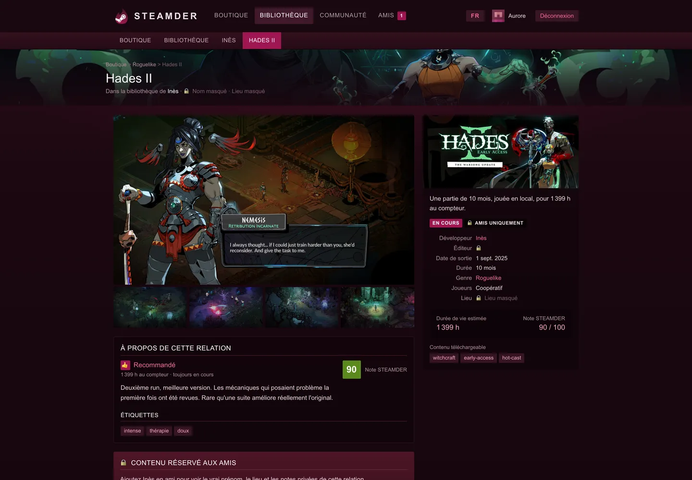
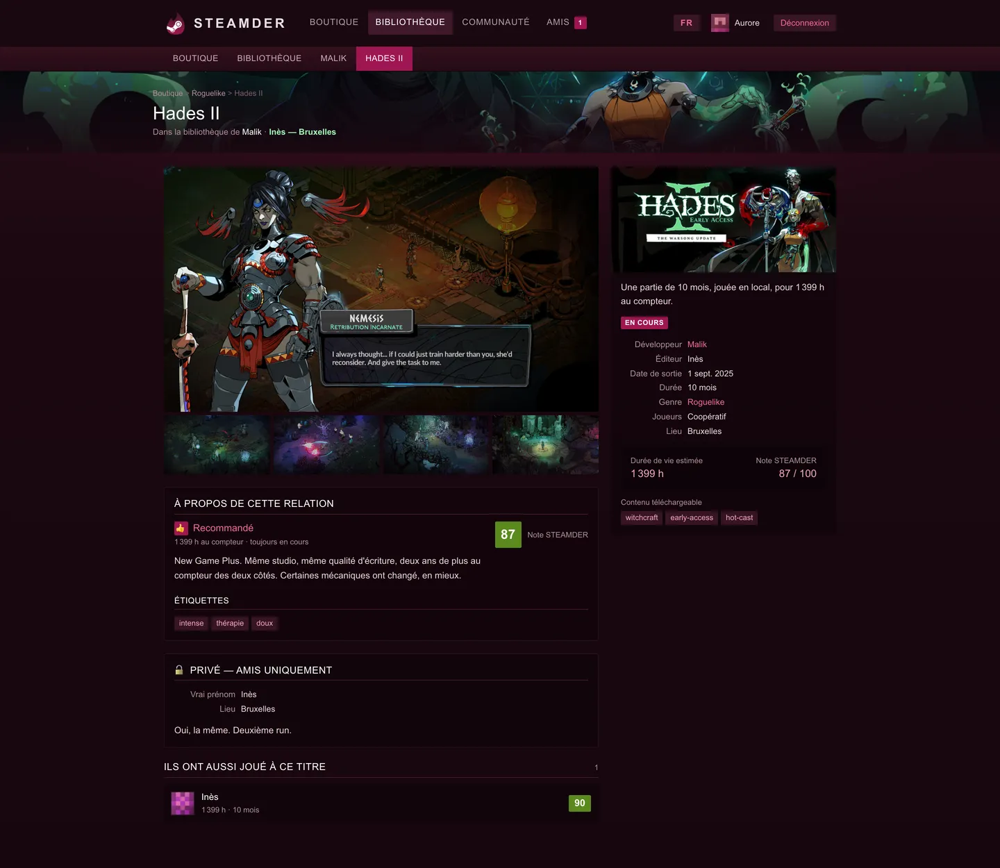
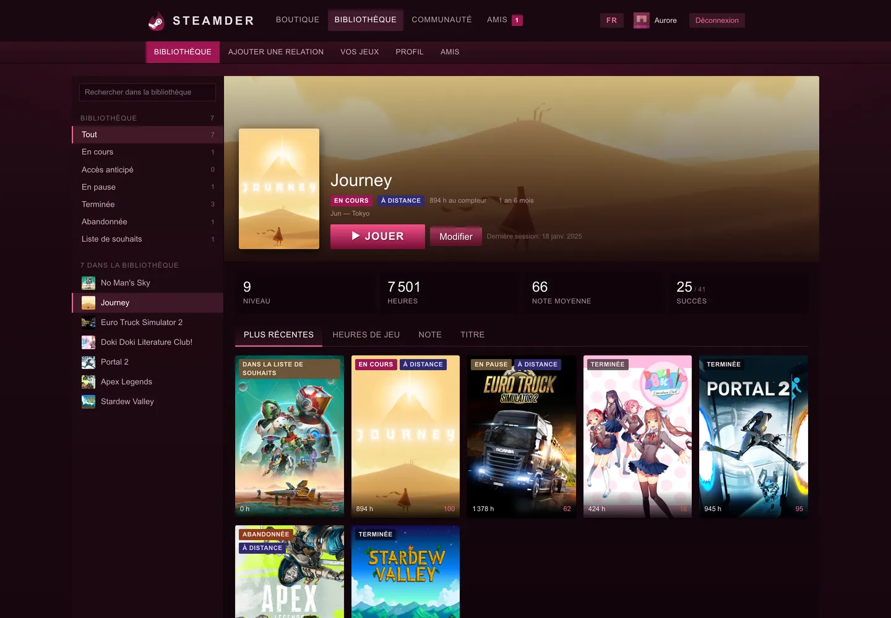
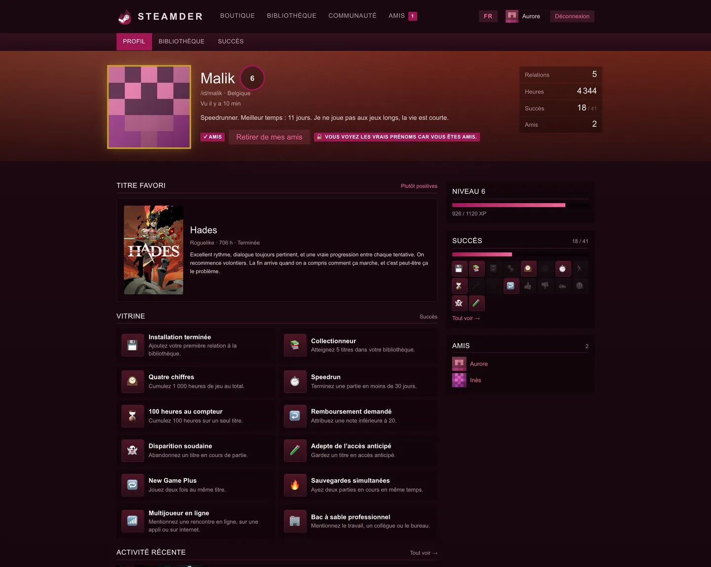
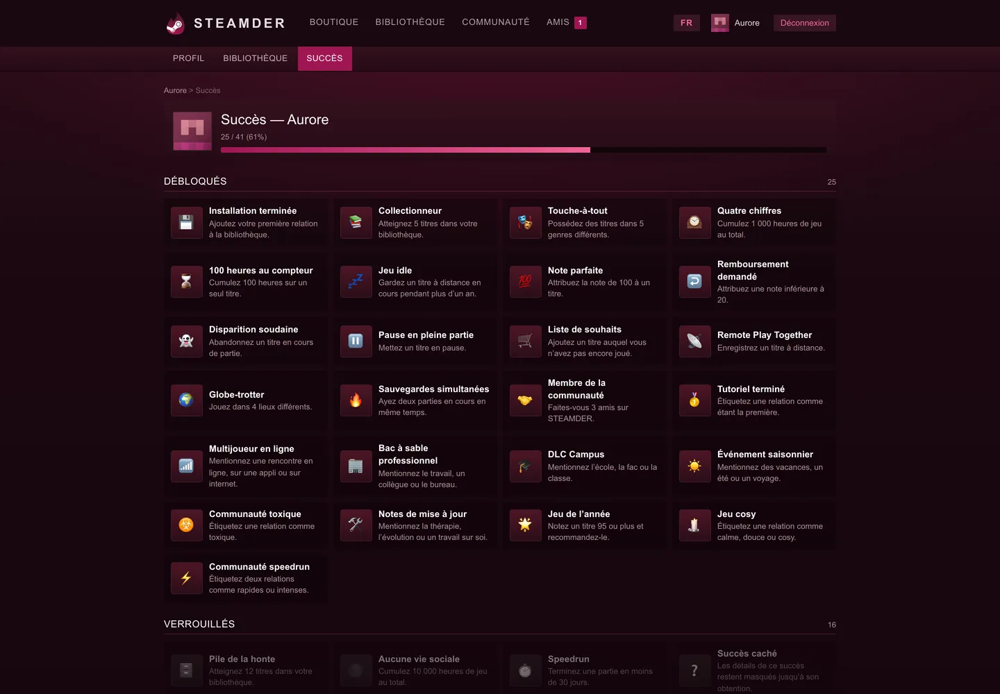
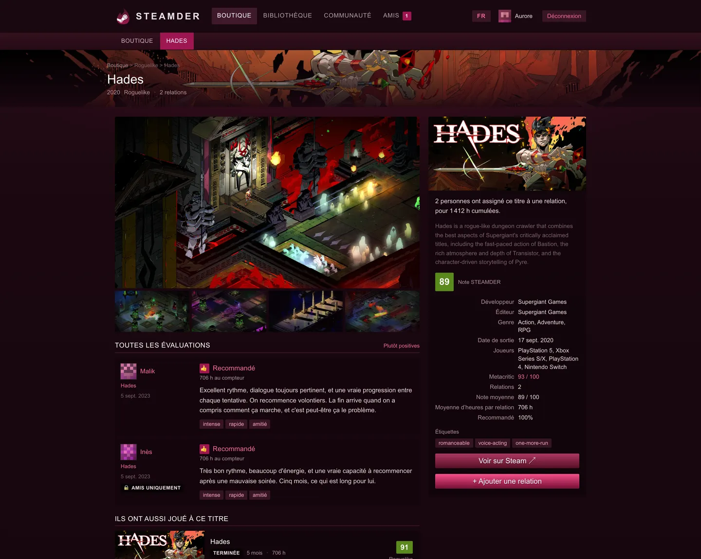
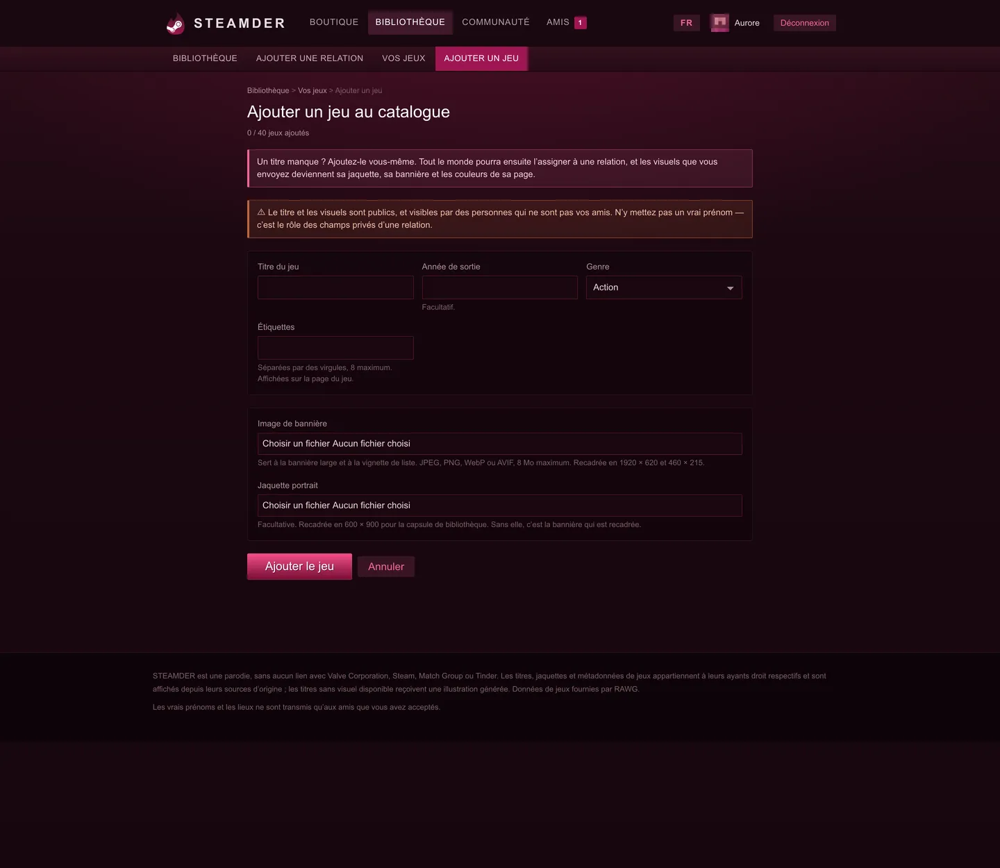
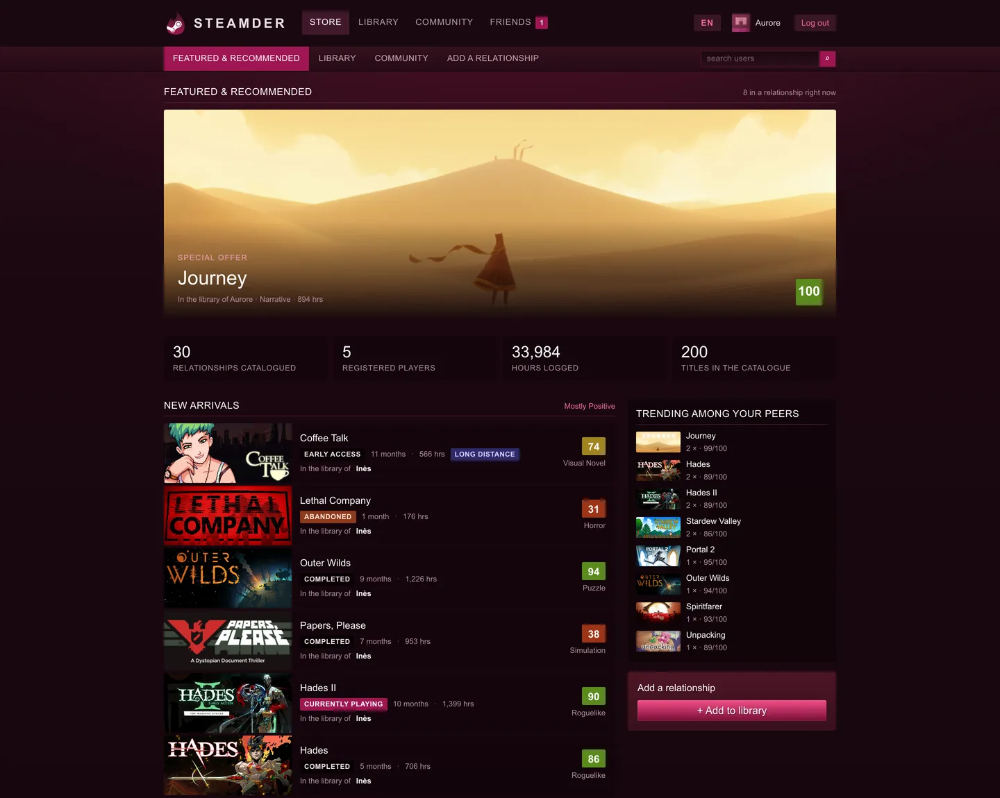
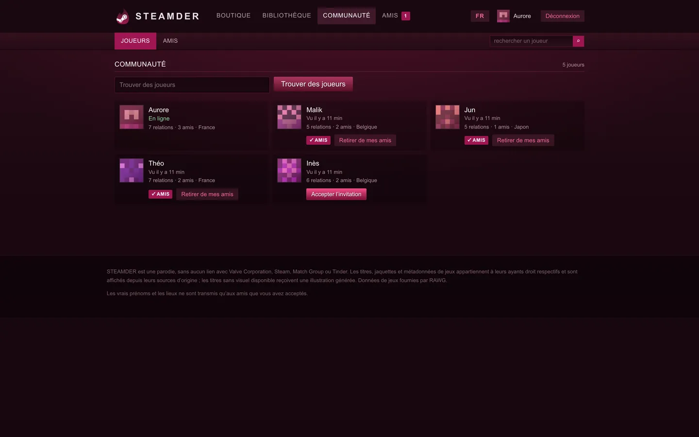

<div align="center">


# STEAMDER

**Vos relations, cataloguées.**

Un site qui traite vos relations amoureuses comme une bibliothèque Steam.
Vous en ajoutez une, vous lui assignez un vrai jeu vidéo, vous la notez sur 100,
vous écrivez l'évaluation. Vos amis voient les vraies informations.
Les autres ne voient que le jeu.

<sub>Parodie. Aucun lien avec Valve Corporation, Steam, Match Group ou Tinder.</sub>


</div>

<br>


<br>

## L'idée

Steam vous dit que vous avez passé 3 000 heures sur Skyrim, que vous l'avez
abandonné à 60 %, et que 94 % des joueurs le recommandent. STEAMDER applique
exactement cette grammaire à vos relations.

Une relation devient un jeu de votre bibliothèque. Sa durée devient des heures
au compteur. Son statut devient « en cours », « accès anticipé », « terminée » ou
« abandonnée ». Vous lui donnez un pouce en haut ou en bas, une note sur 100, et
vous écrivez l'évaluation comme vous le feriez pour un jeu.

Et comme sur Steam, vous choisissez un titre pour l'illustrer. C'est ce jeu qui
définit sa jaquette, sa bannière et les couleurs de sa page.

<br>

## La confidentialité est le cœur du projet

Chaque relation a deux jeux de champs, et une seule chose décide de ce que vous
voyez : l'amitié.

<table>
<tr>
<th width="50%">🔒 Privé — amis acceptés uniquement</th>
<th width="50%">🌍 Public — tout le monde</th>
</tr>
<tr valign="top">
<td>

- le vrai prénom
- le lieu
- les notes privées

</td>
<td>

- le jeu assigné, sa jaquette, sa bannière
- le statut, le verdict, la note sur 100
- la durée, les heures de jeu, à distance ou non
- l'évaluation publique et les étiquettes

</td>
</tr>
</table>

Un inconnu voit donc qu'une relation de 18 mois a été notée 100, recommandée,
jouée à distance, et qu'elle porte le nom de *Journey*. Il ne saura jamais qui
c'était.

Ci-dessous, **le même titre chez deux personnes différentes**, vu par le même
visiteur. À gauche une invitation encore en attente, à droite une amitié acceptée.

<table>
<tr>
<td width="50%"><b>🔒 Invitation en attente</b><br><sub>« Nom masqué · Lieu masqué », éditeur et lieu cadenassés</sub></td>
<td width="50%"><b>🔓 Amitié acceptée</b><br><sub>prénom, lieu et notes privées révélés</sub></td>
</tr>
<tr>
<td></td>
<td></td>
</tr>
</table>

### Comment la règle est appliquée

Elle passe par un seul point : `applyVisibility()` dans
[`src/lib/queries.ts`](src/lib/queries.ts). Pour un non-ami, les colonnes privées
sont **absentes de l'objet**, pas vidées :

```ts
export type VisibleRelationship =
  | ({ revealed: true } & RelationshipRow)
  | ({ revealed: false } & Omit<RelationshipRow,
      'real_name' | 'real_location' | 'private_notes'>);
```

C'est une union discriminée sur `revealed`. Un composant qui tenterait d'afficher
`rel.real_name` sans avoir vérifié `rel.revealed` **ne compile pas**. La fuite
devient une erreur de type, pas un oubli de revue de code.

Vérifié en conditions réelles : dix pages servies à un visiteur anonyme, aucune
chaîne privée dans le HTML ; puis les deux sens du test avec de vraies sessions —
un ami voit, un non-ami reçoit le cadenas.

<br>

## La bibliothèque



La barre latérale, la bannière du titre sélectionné, le bouton **JOUER**, la
grille de capsules 2:3, le tri, les compteurs de niveau et d'heures : c'est le
client Steam, avec vos relations dedans.

Une relation « se joue ». La durée en jours devient des heures au compteur :
4,2 h par jour en présentiel, 1,6 h par jour à distance, 0 pour une liste de
souhaits. Deux ans deviennent donc environ 3 000 heures — l'ordre de grandeur
d'une vraie bibliothèque Steam.

| Statut | Signification |
| --- | --- |
| **En cours** | ça tourne toujours |
| **Accès anticipé** | *situationship* : ni défini, ni fini |
| **En pause** | mis de côté, pas désinstallé |
| **Terminée** | vous êtes allé au générique |
| **Abandonnée** | ghosté, ou abandonné en cours de partie |
| **Liste de souhaits** | jamais lancé |

<br>

## Le profil et les succès

<table>
<tr>
<td width="50%"></td>
<td width="50%"></td>
</tr>
</table>

Profil communautaire Steam complet : bannière teintée par le thème choisi, cadre
d'avatar, badge de niveau circulaire, compteurs empilés, vitrine configurable,
courbe d'XP, liste d'amis.

**41 succès**, en deux familles :

- **Par mots-clefs** — un mot dans les étiquettes ou l'évaluation les déclenche.
  `travail` → *Bac à sable professionnel*. `toxique` → *Communauté toxique*.
  `thérapie` → *Notes de mise à jour*. `ex` → *Contenu historique*.
  `vacances` → *Événement saisonnier*.
- **Par jalons** — la forme de la bibliothèque. *Speedrun* (moins de 30 jours),
  *Marathonien* (plus de 3 ans), *New Game Plus* (deux fois la même personne),
  *Remboursement demandé* (note sous 20), *Globe-trotter* (4 lieux différents),
  *Sauvegardes simultanées* (deux parties en parallèle — succès caché).

Les succès par mots-clefs ne lisent **que** les étiquettes et l'évaluation
publique. Vos notes privées ne sont jamais analysées, donc aucun succès ne peut
laisser deviner ce que vous y avez écrit. Les jalons qui touchent aux colonnes
privées n'utilisent que des compteurs agrégés, jamais les valeurs — exactement ce
qu'expose une liste de succès publique Steam.

<br>

## Les jaquettes

Trois sources, avec repli automatique. **200 titres sur 200 sont appariés.**

| Source | Ce qu'elle fournit | Clé |
| --- | --- | --- |
| **CDN Steam** | jaquette portrait 600×900, bannière 1920×620 — *159 titres* | aucune |
| **RAWG** | métadonnées, art paysage, captures, titres console — *200 titres* | `RAWG_API_KEY` |
| **Générée** | SVG procédural, quand les deux échouent — *1 titre* | aucune |

L'appid Steam est extrait de l'URL du store que RAWG renvoie. Chaque URL distante
est vérifiée par une requête `HEAD` au moment de l'enrichissement : le site
n'affiche donc jamais d'image cassée, ce qui n'est pas vérifié retombe sur le SVG.

La palette de chaque page est **échantillonnée sur la vraie jaquette** avec
`sharp`, comme Steam accorde ses pages store à l'artwork. Une page Hollow Knight
part en bleu profond, une page DOOM en rouille.



Le repli procédural n'est pas un carré vide : huit familles de motifs — rayons,
orbites, éclats, ondes, grille, halos, scanlines, hexagones — choisies par un hash
du slug, plus les initiales du titre. Un jeu donné rend toujours la même image.

<br>

## Les jeux ajoutés par les utilisateurs



Un titre manque ? N'importe qui peut l'ajouter en envoyant ses propres visuels.
Le titre devient disponible pour tout le monde, marqué d'une étoile dans le
sélecteur et d'un badge « Communauté » sur sa page.

**Une seule image suffit.** La bannière est recadrée automatiquement en 1920×620
et 460×215 ; une jaquette portrait facultative fournit le 600×900. La palette est
échantillonnée sur l'image envoyée, donc un titre communautaire se thème
exactement comme un titre officiel.

### Ce que le pipeline d'upload garantit

L'upload accepte des fichiers arbitraires venant du navigateur, donc
[`src/lib/uploads.ts`](src/lib/uploads.ts) part du principe que l'entrée est
hostile :

- **Aucun SVG.** Ces fichiers sont servis depuis notre propre origine ; un SVG y
  est un vecteur d'exécution de script. Seuls JPEG, PNG, WebP et AVIF passent.
- **Rien n'est renvoyé tel quel.** Chaque image est décodée par `sharp` puis
  ré-encodée en WebP, ce qui élimine l'EXIF, les profils de couleur, les charges
  utiles en fin de fichier et les fichiers polyglottes. Le type MIME déclaré par
  le client n'est qu'un indice : c'est le contenu réel qui décide.
- **Plafond de pixels explicite**, pour qu'un petit fichier « bombe de
  décompression » ne puisse pas exploser en mémoire.
- **Les noms de fichiers sont générés depuis un slug validé**, jamais depuis le
  nom envoyé, et la route `/uploads` ne sert que des noms correspondant à ce
  motif — la traversée de chemin est impossible.
- **Un titre utilisé ne peut pas être supprimé**, pour ne jamais laisser une
  bibliothèque pointer vers un titre disparu.

Testé : un SVG contenant `<script>`, renommé `.png` et déclaré `image/png`, est
refusé. Idem pour un fichier de 9 Mo, un texte déguisé en JPEG, un PNG de 8×8, et
les tentatives de traversée `../../`, `%2e%2e%2f` et octet nul sur la route.
Aucun fichier orphelin ne reste sur le disque après un rejet.

Le titre et les visuels sont **publics** : le formulaire le rappelle
explicitement, car y écrire un vrai prénom contournerait tout le modèle de
visibilité.

<br>

## Bilingue

<table>
<tr>
<td width="50%"><b>Français</b> <sub>(par défaut)</sub></td>
<td width="50%"><b>English</b></td>
</tr>
<tr>
<td></td>
<td></td>
</tr>
</table>

Bascule FR / EN dans l'en-tête. L'anglais est la source de vérité du dictionnaire :
une clé française manquante est une **erreur de compilation**, pas un repli
silencieux.

<br>

## Le thème

L'interface reprend délibérément l'anatomie du client web Steam — en-tête à deux
niveaux, sous-navigation, capsules, boutons `btnv6` (rayon 2 px, hauteur 30 px),
page store en deux colonnes 616 / 324, tableau de détails aligné à droite, cartes
d'évaluation, barre d'onglets soulignée, profil communautaire avec badge de niveau
circulaire.

Seule la teinte change : le bleu marine de Steam est remappé sur la plage chaude
`#9f1752` → `#401420`.

| Steam | STEAMDER | Rôle |
| --- | --- | --- |
| `#171a21` | `#190811` | en-tête, navigation globale |
| `#1b2838` | `#2a0d17` | fond de page |
| `#16202d` | `#250b15` | panneaux |
| `#2a475e` | `#4d1526` | panneaux surélevés, champs |
| `#66c0f4` | `#f2679a` | liens, état actif, étiquettes |
| `#417a9b` | `#9f1752` | dégradés de boutons, bordures |
| `#c7d5e0` | `#eed4dd` | texte courant |
| `#a4d007` → `#536904` | `#ef4b85` → `#7c1038` | bouton d'action principal |

La table complète est en tête de
[`src/app/globals.css`](src/app/globals.css).

<br>

## Démarrer

```bash
npm install
```

```bash
npm run dev
```

Le site tourne sur http://localhost:3000. La base démarre vide : créez votre
compte sur `/register`. Aucune clé d'API n'est nécessaire pour faire tourner le
site — le catalogue enrichi est déjà dans le dépôt.

### Explorer avec du contenu

```bash
npm run db:seed
```

Cinq comptes de démonstration et trente relations, mot de passe `steamder123`
pour tous :

| Compte | Profil |
| --- | --- |
| `aurore` | 7 relations, note tout, amie de theo / jun / malik |
| `malik` | 5 relations, speedrunner, ami de ines / aurore |
| `jun` | 5 relations, longue durée, ami d'aurore |
| `theo` | 7 relations, pile de la honte, ami d'aurore / ines |
| `ines` | 6 relations, critique sévère, amie de malik / theo |

**Pour voir le modèle de visibilité en action :** connectez-vous en `aurore` puis
ouvrez `/id/ines`. Les vrais prénoms sont masqués et une invitation attend.
Acceptez-la : les prénoms et les lieux apparaissent.



<br>

## Structure

```
src/
  app/
    page.tsx                    boutique
    library/                    bibliothèque, ajout, édition
    library/games/              jeux soumis : ajout, édition, gestion
    app/[id]/                   page d'une relation (page store)
    game/[slug]/                page d'un jeu (agrégat de tous les joueurs)
    id/[handle]/                profil, bibliothèque publique, succès
    community/  friends/        annuaire, invitations
    settings/                   personnalisation du profil
    art/[kind]/[id]/            route d'images SVG procédurales
    uploads/[name]/             route servant les visuels envoyés
    actions.ts                  toutes les mutations (server actions)
  lib/
    db.ts  queries.ts           SQLite + la règle de visibilité
    auth.ts  session.ts         scrypt, sessions par cookie
    catalog.ts                  résolveur unique : catalogue + soumissions
    games.ts                    catalogue de 200 titres
    customGames.ts              titres soumis par les utilisateurs
    uploads.ts  palette.ts      pipeline d'upload, échantillonnage couleur
    assets.ts                   résolution art réel → procédural
    art.ts                      générateur SVG
    achievements.ts  stats.ts   succès, heures, niveaux
    i18n.ts  lang.ts            FR / EN
scripts/
  seed.ts                       comptes et relations de démonstration
  enrich.ts                     construction du catalogue (RAWG + Steam)
  screenshots.mjs               régénération des captures de ce README
```

<br>

## Scripts

| Commande | Effet |
| --- | --- |
| `npm run dev` | serveur de développement |
| `npm run build` | build de production |
| `npm run typecheck` | `tsc --noEmit` |
| `npm run db:seed` | ajoute les comptes de démonstration manquants |
| `npm run db:reset` | vide les tables puis réinsère |
| `npm run db:wipe` | supprime la base pour repartir de zéro |
| `npm run enrich` | reconstruit le catalogue depuis RAWG + Steam |
| `npm run screenshots` | régénère les captures de ce README |

### Reconstruire le catalogue

```bash
npm run enrich -- --force
```

Nécessite une clé RAWG gratuite dans `.env.local` (voir
[`.env.example`](.env.example)). `--only slug1,slug2` cible quelques titres ;
sans `--force`, seules les entrées manquantes sont traitées. L'écriture se fait
par lots de 10, donc une interruption ne perd rien.

`.env.local` n'est lu **qu'au moment de l'enrichissement**.

<br>

## Variables d'environnement

Toutes optionnelles. Voir [`.env.example`](.env.example).

| Variable | Défaut | Rôle |
| --- | --- | --- |
| `RAWG_API_KEY` | — | requis uniquement par `npm run enrich` |
| `STEAMDER_SITE_URL` | `https://steamder.com` en production | origine publique, pour Open Graph et le sitemap |
| `STEAMDER_DB` | `./data/steamder.db` | emplacement de la base |
| `STEAMDER_UPLOADS` | `./data/uploads` | emplacement des visuels envoyés |

<br>

## Pile technique

Next.js 15 (App Router, server actions) · React 19 · TypeScript strict ·
Tailwind 4 avec un design system maison · SQLite via `better-sqlite3` ·
traitement d'images par `sharp` · mots de passe hachés en `scrypt`,
sessions par cookie `httpOnly`.

Pas de client d'état, pas de bibliothèque de composants, pas d'ORM. 102 ko de
JavaScript partagé sur l'ensemble du site.

<br>

## Droits et attribution

STEAMDER est une **parodie**, sans aucun lien avec Valve Corporation, Steam,
Match Group ou Tinder.

Les titres de jeux, jaquettes et métadonnées appartiennent à leurs ayants droit
respectifs. Les visuels sont affichés depuis leurs CDN d'origine (hotlink), pas
recopiés sur ce serveur — c'est la pratique des widgets Steam et de SteamDB. Les
titres sans visuel disponible reçoivent une illustration générée.

Données de jeux fournies par [RAWG](https://rawg.io).

Si vous déployez publiquement, sachez que vous affichez de l'œuvre tierce sous
couvert de parodie et de citation.

<br>

<div align="center">
<sub>
Les vrais prénoms et les lieux ne sont transmis qu'aux amis que vous avez acceptés.
</sub>
</div>
